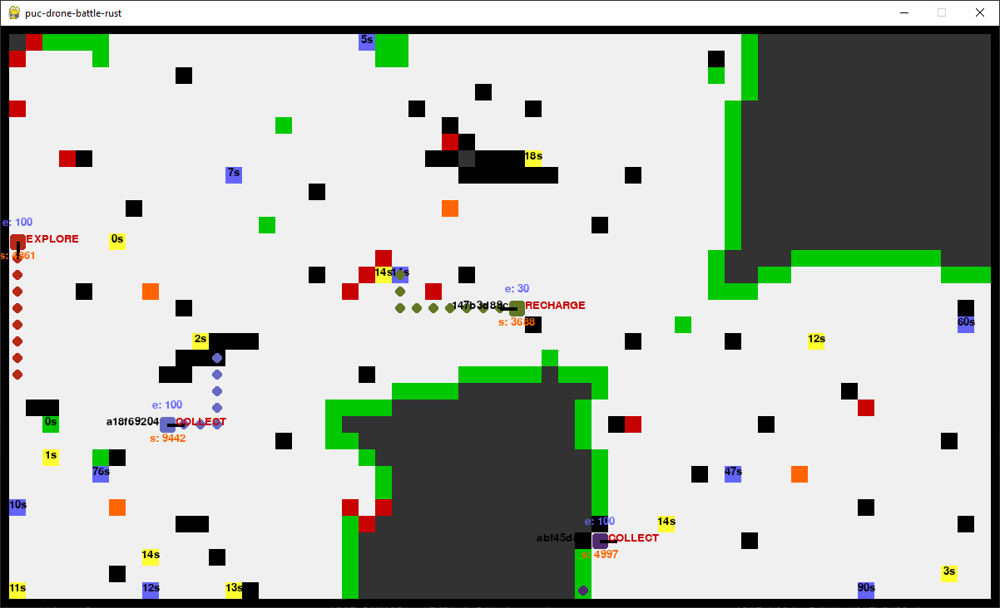

# Batalha de Drones

Projeto para a 1.ª Competição de IA do Departamento de Informática da PUC-Rio

Este é uma cópia do [trabalho 4 para INF1771 — Inteligência Artificial](https://github.com/Leinadium/puc-drone-battle), 
porém dessa vez este trabalho foi escrito em Rust, em vez de Java.

**Para acessar a API, troque para a branch [public_base](https://github.com/Leinadium/puc-drone-battle-rust/tree/public_base)**

Desenvolvido por Daniel Guimarães



## Descrição

A descrição da competição pode ser encontrada [aqui](https://augustobaffa.pro.br/site/desafios-online/inf1771-inteligencia-artificial-desafio-dos-drones/)

Este projeto envolve a construção de uma inteligência artificial para competir numa batalha de “drones”.

## Requirementos

* [Rust/Cargo](https://www.rust-lang.org/) 

Para a parte gráfica, também será necessário:

* [Python 3.9 ou maior](https://python.org)

* [Mosquitto](https://mosquitto.org/download/) ou outro broker MQTT

## Utilização

Clone o repositório
```bash
$ git clone https://github.com/Leinadium/puc-drone-battle-rust
$ cd puc-drone-battle-rust
```

Edite o `config.json` conforme a necessidade. A seguir estão as descrições de cada configuração disponível

```json5
{
  "name": "nome_do_drone",    // nome do drone
  "url": "example.com",       // url do servidor
  "slow_timer": 1000,         // maior intervalo de comunicação entre o servidor (ms)
  "normal_timer": 100,        // intervalo de comunicação padrão entre o servidor (ms)
  "min_timer": 100,           // mínimo intervalo de comunicação entre o servidor (ms)
  "default_color": {          // cor do drone, em RGB
    "r": 23,
    "g": 179,
    "b": 132,
    "a": 0    // não usado
  },
  "spawn_timer": 18000,       // tempo de nascimento de um ouro ou powerup (ms)
  "graphics": true            // true para ativar a visualização, false para exibir as informações somente no terminal
}
```

Compile o programa, e execute, fornecendo como argumento o caminho até esse arquivo. Caso o caminho esteja incorreto, será
usada uma configuração padrão.

```bash
$ cd drone-battle

# compilando e executando ao mesmo tempo
$ cargo run --release -- ../config.json

# compilando, e depois executando (recomendado)
$ cargo build --release
$ ./target/release/puc-drone-battle-rust ../config.json
```


## Visualização gráfica

Para poder ter uma visualização gráfica do seu drone (e de outros drones seus rodando em paralelo), primeiro é necessário
instalar os requerimentos para o Python.

```bash
# caso queira iniciar um ambiente virtual
# windows
$ python -m venv venv
$ venv\Scripts\activate
# mac/linux
$ python3 -m venv venv
$ ./venv/bin/activate

# instalando requerimentos
$ cd graphics
$ python -m pip install -r requirements.txt   # python3 e pip3 para mac/linux
```

Depois, inicie o broker MQTT localmente, e execute o arquivo `graphics/main.py`

Agora, execute um ou mais drones, *com nomes diferentes*. Será exibida uma janela do pygame com os drones 
e suas informações

